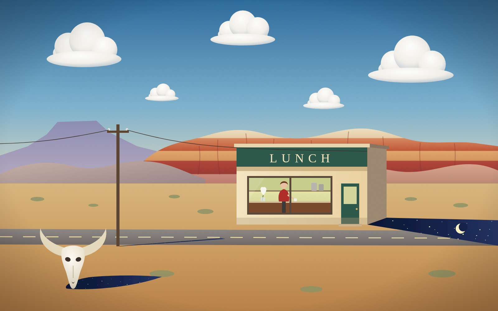

# Night Keeps to the Shade

*Original work, 2026. Vector painting (SVG), 1600 × 1000.*

A lone lunch counter stands by a desert highway on a bright afternoon.
Inside, a woman in red sits at the counter under electric light. She is
alone in the middle of the day. Outside, every shadow, cast by the
building, the telephone pole and a sun-bleached skull, holds the night:
deep indigo, full of stars, with a crescent moon lying in the shade.

- **Hopper:** the roadside building, the raking light, the plain facade,
  a single figure at a counter seen through plate glass, and the loneliness
  of a place built for passing traffic.
- **O'Keeffe:** the flat-topped Pedernal mesa, the banded red and ochre
  Ghost Ranch cliffs, the soft rose hills, the bleached skull, and a white
  jimsonweed in a glass on the counter.
- **Magritte:** day and night together in one picture (a nod to
  *The Empire of Light*), under his plain blue sky and clean, sculpted
  clouds. The strange part is painted as if it were perfectly ordinary.
